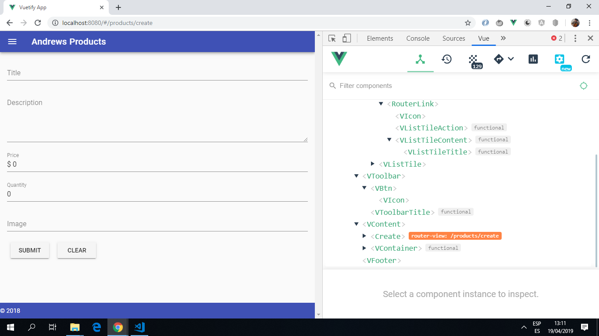

# Vue Vuetify Crud App

App using the Vue.js + vuetify material design framework to built a CRUD client

**Note:** to open web links in a new window use: _ctrl+click on link_

## Table of contents

- [General info](#general-info)
- [Screenshots](#screenshots)
- [Technologies](#technologies)
- [Setup](#setup)
- [Features](#features)
- [Status](#status)
- [Inspiration](#inspiration)
- [Contact](#contact)

## General info

- This tutorial project creates a simple store where products can be created using Vue forms. Products are displayed and can be edited and deleted.

## Screenshots

.

## Technologies

- [Vue framework v2.6.10](https://vuejs.org/)

- [Vue Router v3.0.6](https://router.vuejs.org/) the official router for Vue.js

- [Vue CLI v3.6.0](https://github.com/vuejs/vue-cli)

- [Vuetify Material Design Component Framework v1.5.12](https://vuetifyjs.com/en/)

- [Vuelidate v0.7.3 model-based validation](https://vuelidate.netlify.com/)

- [ezFetch v1.2.0](https://www.npmjs.com/package/ez-fetch) tech wrapper to simplify network requests.

- [Vue DevTools extension for Chrome](https://chrome.google.com/webstore/detail/vuejs-devtools/nhdogjmejiglipccpnnnanhbledajbpd) was useful for debugging and seeing what was happening with the state when Vuex was used.

## Setup

Run `npm run serve` then navigate to `http://localhost:8080/`. The app will automatically reload if you change any of the source files.

## Code Examples

- use of [ezFetch](https://www.npmjs.com/package/ez-fetch) in API.js file

```javascript

import ezFetch from 'ez-fetch';

const API_URL = 'https://localhost:3000/api/v1/products';

export default {
  getProducts() {
    return ezFetch.get(API_URL);
  },
  getProduct(id) {
    return ezFetch.get(`${API_URL}/${id}`);
  },
  createProduct(product) {
    return ezFetch.post(API_URL, product);
  },
  updateProduct(id, product) {
    return ezFetch.put(`${API_URL}/${id}`, product);
  },
  deleteProduct(id) {
    return ezFetch.delete(`${API_URL}/${id}`);
  },
};

```

## Features

- create, read, update and delete (CRUD) products.

## Status & To-Do List

- Status: App runs on dev server. Form validation not working

- To-Do: Update form validation to latest vue methods. Conside linking to an external database.

## Inspiration

- [Code Garden Youtube video: "Intro and Overview of Vuetify.js (Build a CRUD client with Vue.js)"](https://www.youtube.com/watch?v=5GfpGaHKfyo)

## Contact

Created by [ABateman](https://www.andrewbateman.org) - feel free to contact me!
