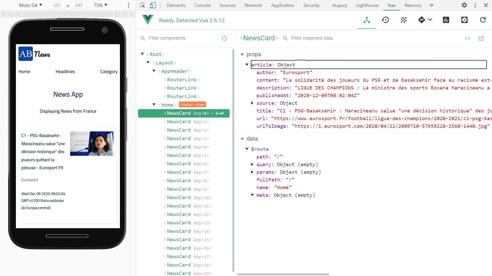

# :zap: Vue Vuetify API App

* App using the Vue.js + vuex material design framework to display News API data

**Note:** to open web links in a new window use: _ctrl+click on link_

## :page_facing_up: Table of contents

* [:zap: Vue Vuetify API App](#zap-vue-vuetify-api-app)
  * [:page_facing_up: Table of contents](#page_facing_up-table-of-contents)
  * [:books: General info](#books-general-info)
  * [:camera: Screenshots](#camera-screenshots)
  * [:signal_strength: Technologies](#signal_strength-technologies)
  * [:floppy_disk: Setup](#floppy_disk-setup)
  * [:computer: Code Examples](#computer-code-examples)
  * [:cool: Features](#cool-features)
  * [:clipboard: Status & To-Do List](#clipboard-status--to-do-list)
  * [:clap: Inspiration](#clap-inspiration)
  * [:envelope: Contact](#envelope-contact)

## :books: General info

* Gets latest news from the News API and displays it on responsive cards
* `.prettierrc` file added to configure Prettier settings, `@vue/prettier` had to be overridden
* BEM —Block, Element, Modifier — CSS methodology used:
_* `.block { ... }` represent a component. They’re standalone entities and are meaningful on their own.
* `.block__element { ... }` parts of a .block. They have no standalone meaning and must be tied to a block.
* `.block--modifier { ... }` used as flags on blocks or elements. We can use them to change the appearance, behavior, or state of elements. For example, to use a hidden flag, we could say `.block--hidden`._

## :camera: Screenshots

.

## :signal_strength: Technologies

* [Vue framework v2](https://vuejs.org/)
* [vuex v3](https://vuex.vuejs.org/)
* [Vue DevTools extension for Chrome](https://chrome.google.com/webstore/detail/vuejs-devtools/nhdogjmejiglipccpnnnanhbledajbpd) was useful for debugging and seeing what was happening with the state when Vuex was used.
* [Electron v11](https://www.electronjs.org/) to build a cross-platform **desktop** app.
* [Vue CLI Plugin Electron Builder](https://nklayman.github.io/vue-cli-plugin-electron-builder/) to build a Vue.js App For Desktop With Electron
* [Axios v0.21.0](https://www.npmjs.com/package/axios) promise based HTTP client for the browser and node.js

## :floppy_disk: Setup

* For a dev server: run `npm run serve` then navigate to `http://localhost:8080/`. The app will automatically reload if you change any of the source files.
* To create WINDOWS build file: run `npm electron:build -- --win nsis`

## :computer: Code Examples

* extract from `store/index.js` showing Vuex store

```javascript
const store = new Vuex.Store({
  state: {
    countries: [
      {
        name: "United States of America",
        value: "us",
      },
      {
        name: "Great Britain",
        value: "gb",
      },
      {
        name: "France",
        value: "fr",
      },
      {
        name: "Canada",
        value: "ca",
      },
      {
        name: "Germany",
        value: "gr",
      },
    ],
    categories: [
      "business",
      "entertainment",
      "general",
      "health",
      "science",
      "sports",
      "technology",
    ],
  },
  mutations: {},
  actions: {
    async getNews(context, country) {
      let res = await axios({
        url: `/top-headlines?country=${country}`,
        method: "GET",
      })
      return res
    },
  },
})const store = new Vuex.Store({
  state: {
    countries: [
      {
        name: "United States of America",
        value: "us",
      },
      {
        name: "Great Britain",
        value: "gb",
      },
      {
        name: "France",
        value: "fr",
      },
      {
        name: "Canada",
        value: "ca",
      },
      {
        name: "Germany",
        value: "gr",
      },
    ],
    categories: [
      "business",
      "entertainment",
      "general",
      "health",
      "science",
      "sports",
      "technology",
    ],
  },
  mutations: {},
  actions: {
    async getNews(context, country) {
      let res = await axios({
        url: `/top-headlines?country=${country}`,
        method: "GET",
      })
      return res
    },
  },
})
```

## :cool: Features

* News API key hidden from Github repo using .env - included in Vue; in Vue 2 npm dotenv was required

## :clipboard: Status & To-Do List

* Status: Working on dev server. Displays news cards but header menu buttons do not do anything. The command `npm run electron:build` does not work and it is quicker to recreate from scratch than to try to fix.
* To-Do: add day.js formatting of date, change random country for user country using apapi API

## :clap: Inspiration

* [Smashing Magazine: article by Timi Omoyeni: Building Desktop Apps With Electron And Vue](https://www.smashingmagazine.com/2020/07/desktop-apps-electron-vue-javascript/)

## :envelope: Contact

* Repo created by [ABateman](https://www.andrewbateman.org) - you are welcome to [send me a message](https://andrewbateman.org/contact)
